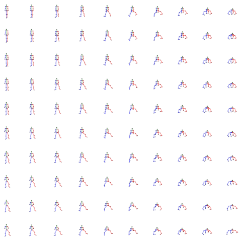
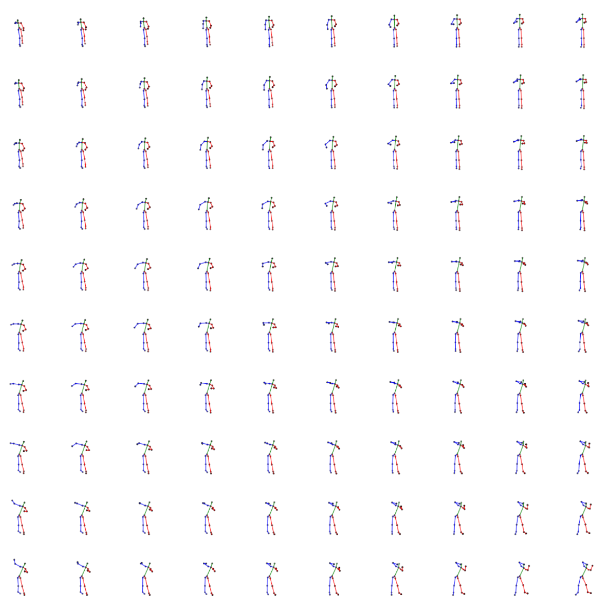
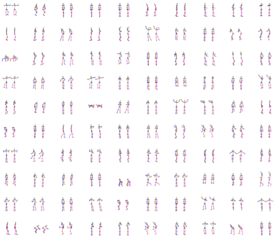

# Pose2vec
This repository contains the following:
  - Utilities for various human skeleton preprocessing steps in numpy and tensorflow.
  - Tensorflow model to learn a continuous pose embedding space.

This code has been used to train the PoseGAN (or _EnGAN_) Model in the paper: <br>
**Maharshi Gor***, Jogendra Nath Kundu*, R Venkatesh Babu, ["Unsupervised Feature Learning of Human Actions as Trajectories in Pose Embedding Manifold"](https://arxiv.org/abs/1812.02592), _IEEE Winter Conference on Applications of Computer Vision (WACV), 2019_.

It is also used for training pose representations in the paper: <br>
**Maharshi Gor***, Jogendra Nath Kundu*, R Venkatesh Babu, ["BiHMP-GAN: Bidirectional 3D Human Motion Prediction GAN"](https://arxiv.org/abs/1812.02591), _Thirty Third AAAI Conference on Artificial Intelligence, 2019_.

### Citing this work
If you find this work useful in your research, please consider citing:
```
@article{kundu2018unsupervised,
  title={Unsupervised Feature Learning of Human Actions as Trajectories in Pose Embedding Manifold},
  author={Kundu, Jogendra Nath and Gor, Maharshi and Uppala, Phani Krishna and Babu, R Venkatesh},
  journal={arXiv preprint arXiv:1812.02592},
  year={2018}
}
```

### Data and Pretrained Weights
Use the following command to download the data and pretrained weights.
```
# For downloading the data. It will be saved in the data/ directory
python -m scripts.download_data

# For downloading the pretrained weights. It will be saved in the pretrained_weights/azimuth/ directory
python -m scripts.download_weights
```

### Qualitative Results:
- Grid Interpolations <br>




- Reconstructions (left: Ground Truth, right: Reconstruction)

